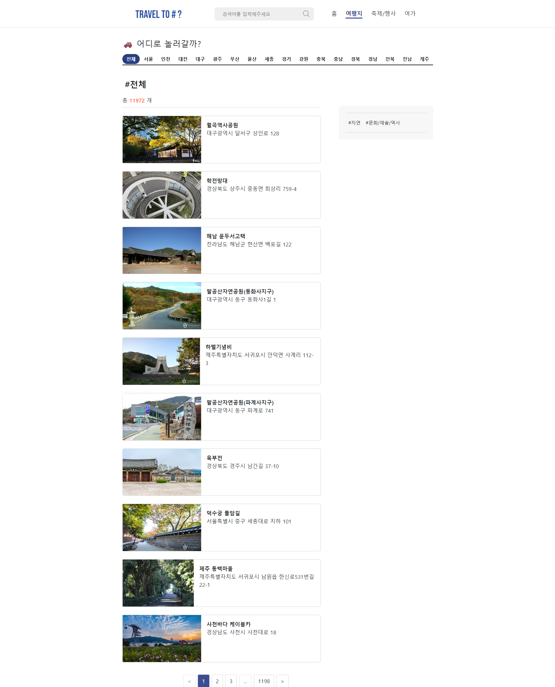
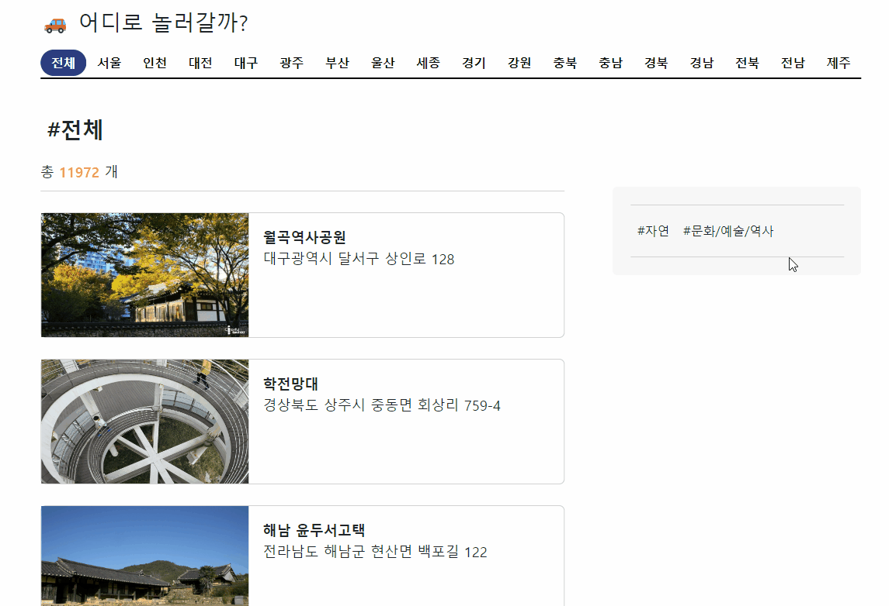
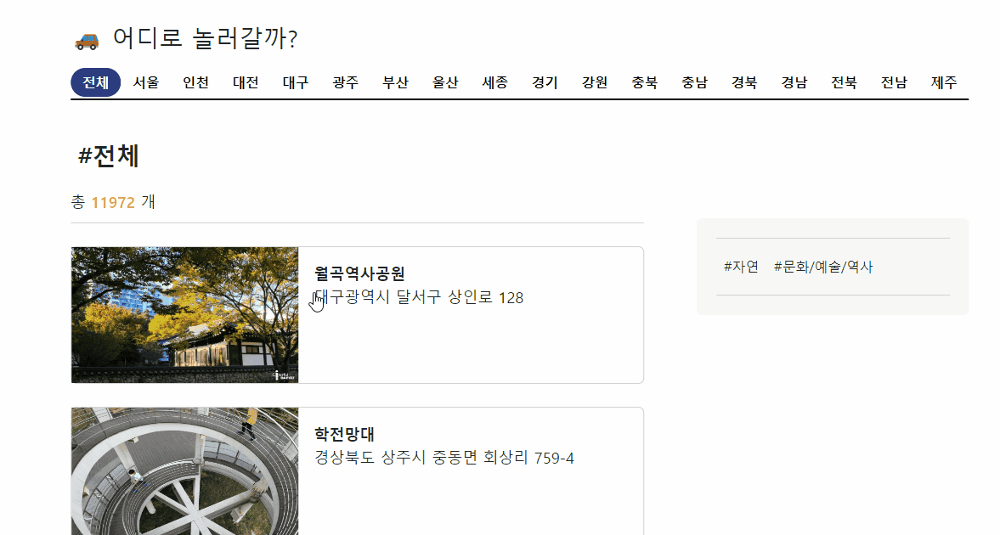
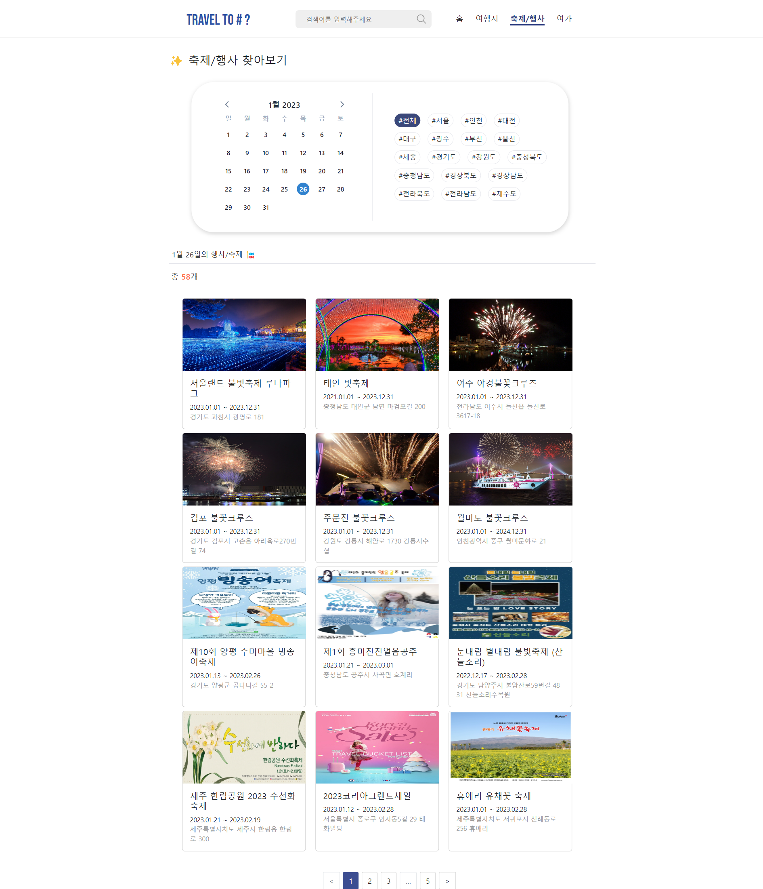
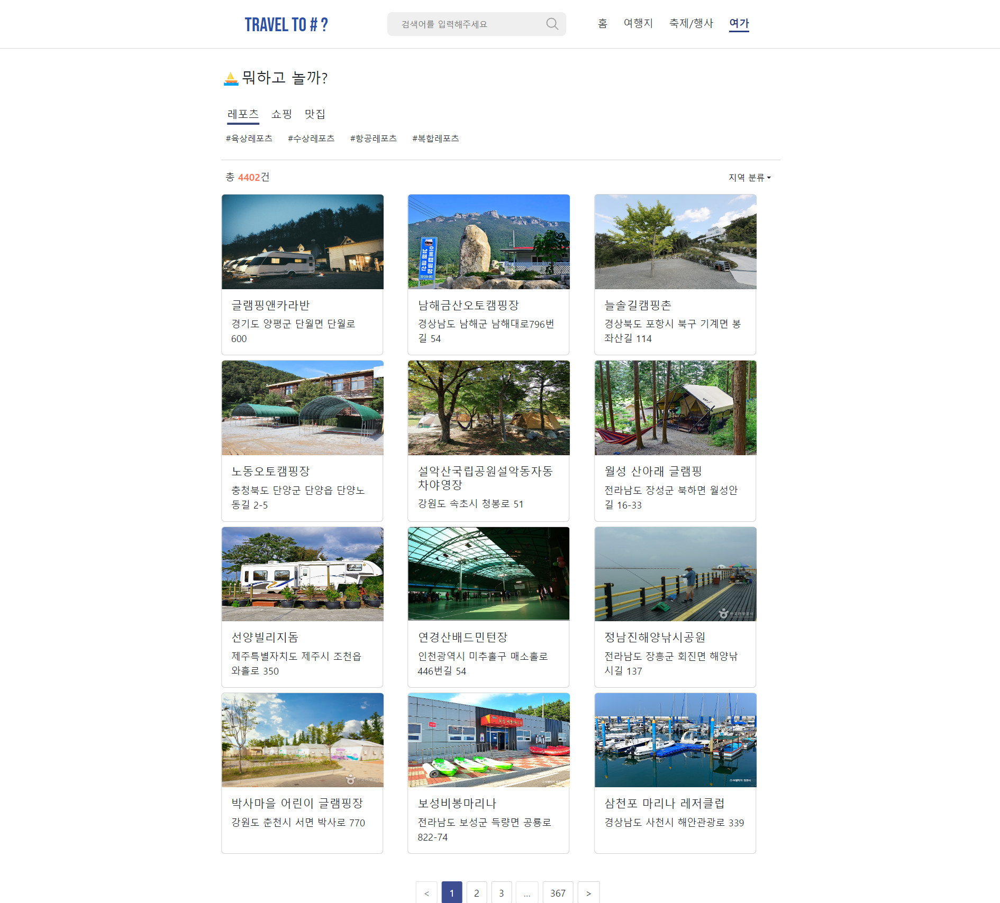
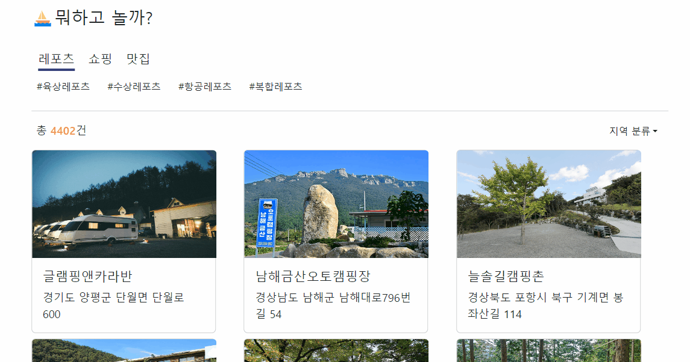
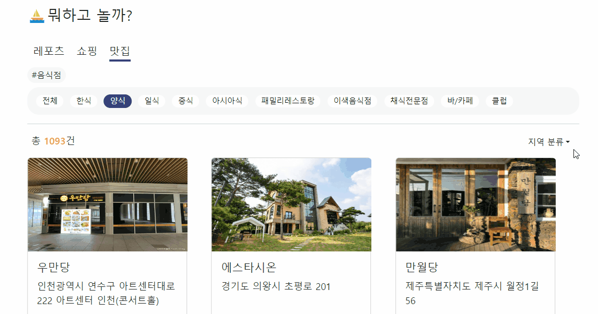
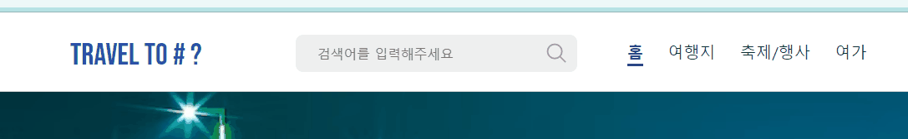
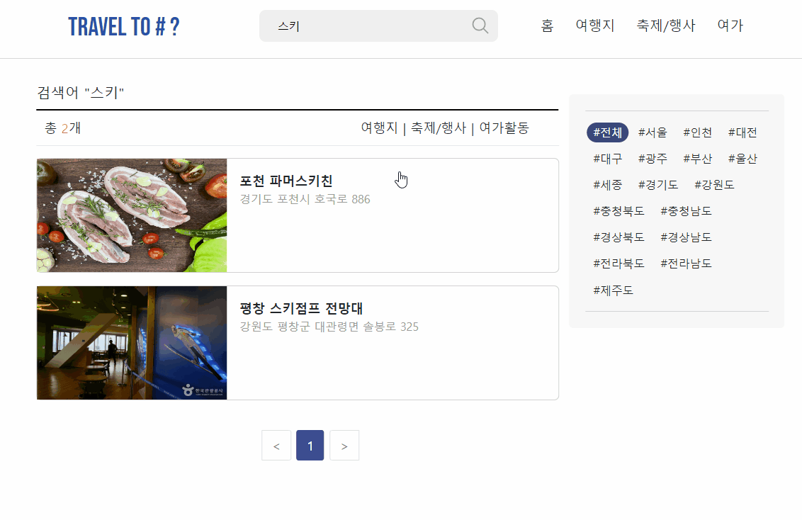

# TRAVEL TO # ?

'TRAVEL TO # ?'는 어디론가 여행을 떠나고 싶은 막연한 생각(어디 가지, 뭐 하지 등)들을 태그(#)로 표현하고 선택함으로써 구체화해나가자는 의미로 정한 이름입니다.
한국관광공사의 '국문 관광정보 서비스' API를 이용하여 여행정보를 제공합니다.

:small_orange_diamond: DATA Reference : https://www.data.go.kr/data/15101578/openapi.do

:small_orange_diamond: 홈화면 이미지 출처
- 메인이미지(해변), 서울, 인천, 대전, 대구, 광주, 부산, 강원, 충남, 충북, 경북, 경남, 전북, 전남, 제주: <strong>Unsplash (https://images.unsplash.com/)</strong>
- 울산, 세종, 경기: <strong>Pixabay (https://cdn.pixabay.com/)</strong>

 

### heavy_exclamation_mark::heavy_exclamation_mark: STILL IN DEVELOPMENT heavy_exclamation_mark::heavy_exclamation_mark:

 

 

### 개발 완료된 기능 소개

#### :small_orange_diamond:홈
 

- 홈 화면: 서울~제주 이미지 슬라이드

(gif 1.5배속)

- 홈 컨텐츠: 이번 주 축제, 지역 바로가기

 

#### :small_orange_diamond:여행지
 

- 여행지 조회 화면

- 카테고리 분류

- 지역 분류

 

#### :small_orange_diamond:축제/행사
 

- 축제/행사 조회 화면 : 날짜, 지역 분류

 

#### :small_orange_diamond:여가
 

- 여가활동 조회 화면

- 레포츠 카테고리 분류

- 쇼핑, 맛집 카테고리 분류

- 지역 분류

 

#### :small_orange_diamond:검색 기능
 

- 검색어 입력

- 결과 화면

